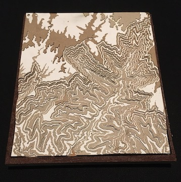
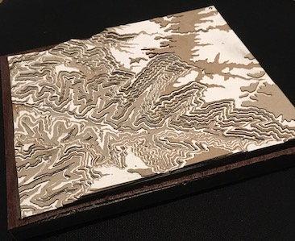
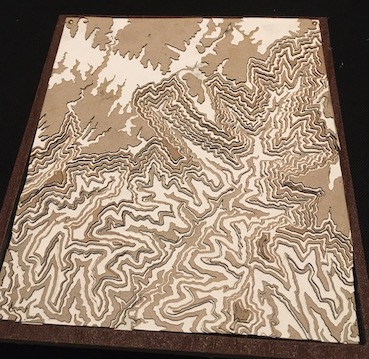
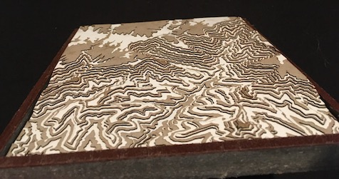

# Contour Map - Grand Canyon - Bright Angel

## Description

Create a layered topographic contour map. Each layer reflects a topographic change in the map to create a true 3 dimensional effect. Started with a section of the Grand Canyon based on the amount of elevation change over a short distance (i.e. the walls are steep).

## Final Pics

Bigger pictures: 

## Notes
- Initially tried converting downloaded PDF versions of maps into SVG files but that generated image files.  A bitmap to vector conversion on those generated disparate files to be linked together.

- With a little searching, I found a great writeup at theshamblog (see link below). It describes the process of pulling GIS information and breaking it up using QGIS mapping software.

- QGIS works on a data set that creates topographic paths across the entire map. It can create topographic maps and then generate an SVG for each individual path. I color coded each elevation path and used Inkscape to separate each topo into its own file.

- I used recycled some white paper stock, cereal boxes, and some Trex decking I had lying around. It uses a surprising number of layers so it burned up quite a few old pieces of cardboard box. I think the only thing I purchased for this one was some additional glue.

- The frames were made of some leftover Trex material I had. I used the CNC to route out a precise frame but that process took a lot of time. I'd probably use another type of framing on future runs to avoid the need for the CNC entirely.

## References
- https://theshamblog.com/making-a-laser-cut-topo-map-the-design-phase/
- Software
  - https://inkscape.org/
  - https://www.qgis.org/en/site/forusers/alldownloads.html#debian-ubuntu
  - https://snapmaker.com/product/snapmaker-2/downloads
- Data
  - http://www.webgis.com/terr_pages/AZ/dem1/coconino.html
    - Used the *Bright Angel Point* file
  - https://www.pickatrail.com/topo-map/b/7.5x7.5/bright-angel-point-az.html

## Materials
- Single layer card stock
  - White layers
  - Weight: 
- Sides of cardboard cereal boxes
  - Brown layers
  - Material is *~ 0.5mm* thick but can be irregular
- Piece of cutoff Trex decking
  - Used for the backing frame
  - Routed out profile and cut to size afterwards
  - Was available material
- Small nails for registration pins
- Glue

## Software and Tooling:
- QGIS software (free - see references)
- InkScape (free - see references)
- SnapMaker Luban (free - see references)
- SnapMaker A350 with 1600mW laser to cut each layer.
- SnapMaker A350 with CNC cutter to create backing frame.

## Process
- Install QGIS software
- Download GIS file
- Load in QGIS and break into layers
- Open in Inkscape and reprocess
  - For each layer
    - Create a new layer
    - Select a color
    - Select all same color
    - Select *group* for each one to avoid losing color information
    - Move groups to their own layer
  - For Background
    - Create separate layer
    - Add rectangle around entire box
    - Add calibration circles that should appear in each layer.
- Create files with SnapMaker Luban (verion 3.15)
  - Background layer contains outline an calibration holes
  - Each layer file contains topographic paths

## Machine Settings:
- For full cut
  - 2 passes
  - 0.6mm per cut (default)
  - 300mm / minute
- Sequence
  - Cut layer first
  - Cut background second to avoid fallout
